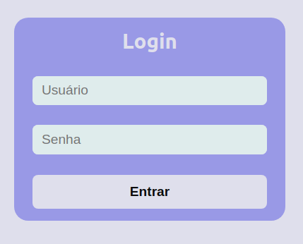
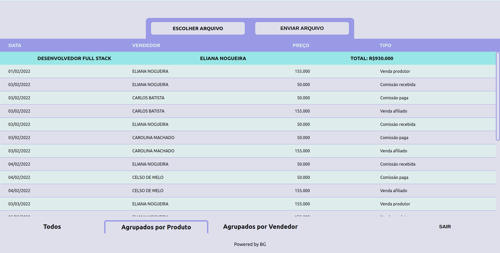
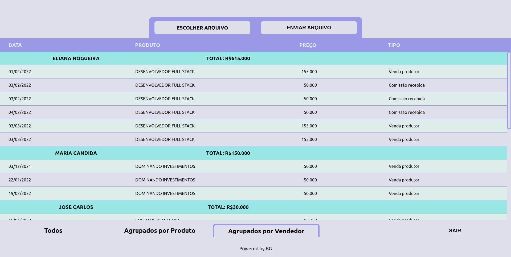

# FullStack Afiliados SPA

This is a challenge by [Coodesh](https://coodesh.com/)

## Descrição

Aplicação desenhada para providenciar uma entrada de arquivos de texto no formato “.txt”, capturar, processar, guardar e exibir a informação contida em dito arquivo.

## Tecnologias ferramentas utilizadas

- react
- javascrip
- html
- css
- yarn
- github

## Para que serve?

A empresa que solicitou esta aplicação teve um incremento no número de transações e estas transações precisam ser registradas e processadas. O ingreso manual de informação leva muito tempo e ainda aumenta o risco de informação omitida ou mal ingresada.

Esta aplicação captura toda esta informação contida no `arquivo.txt`:

- separa o texto por linhas
- divide os dados de cada linha
- cria objetos `{chave: valor}`
- guarda a informação na entidade correspondente e
- apresenta na tela toda essa informação de uma forma ordenada e compreensível, de tal forma que possa ser analisada e assimilada ao máximo.

Sendo assim, em resposta a esta pergunta, esta aplicação vem para agilizar todo esse procedimento, com todos os beneficios que significam o poupar tempo e recursos. Se faz necessário salientar o fato de que o `arquivo.txt` tem o layout predeterminado, o que significa que qualquer alteração em dito layout pode fazer com a aplicação devolva informação defeituosa.

## Como funciona?

Uma vez que o usuario acessa a aplicação, deve fazer login e automáticamente é direcionado à tela principal onde tem um butão para carregar o `arquivo.txt` e outro butão para processar a informação. Pronto!

### Login?

Sim, mesmo que não era prioridade ter uma verificação de usuário, a aplicação inicia com um formulário de Login onde o usuário e senha por defeito é `admin`. Nas condições atuais, a aplicação, cadastra usuários sem cadastrar senha, porém, o único usuário autorizado para utilizar a aplicação é o `admin`.

